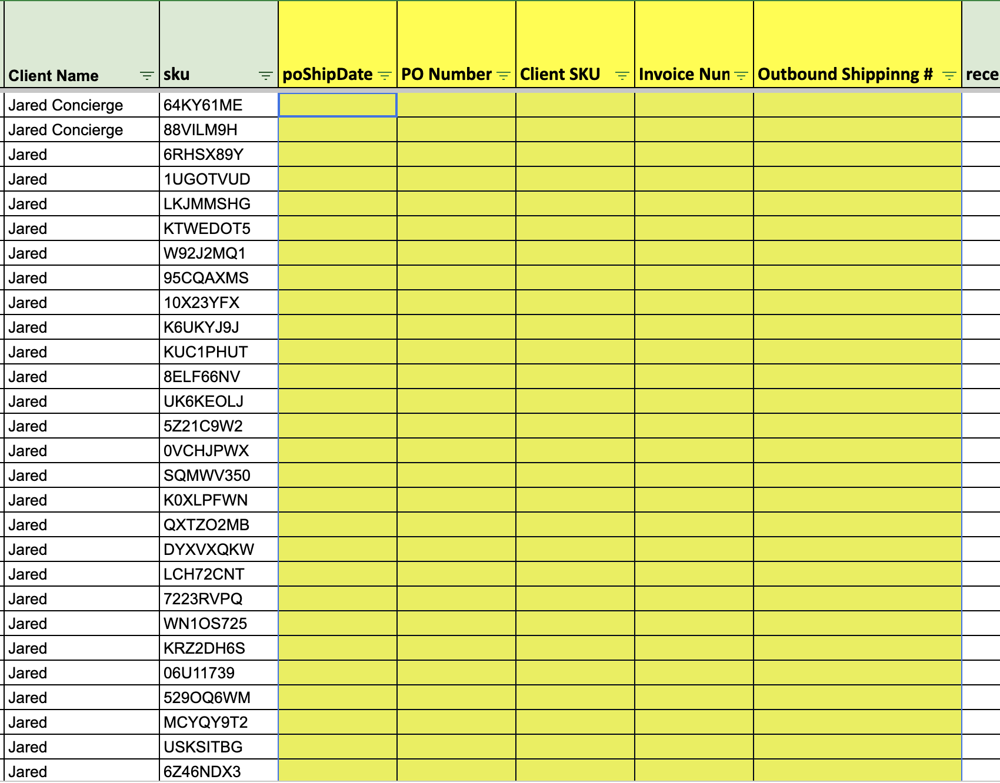
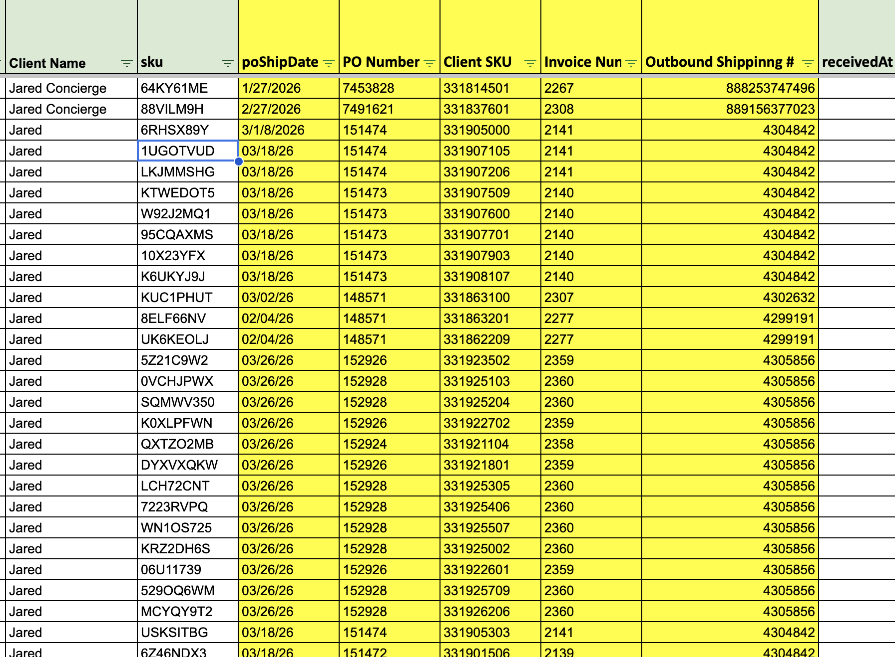
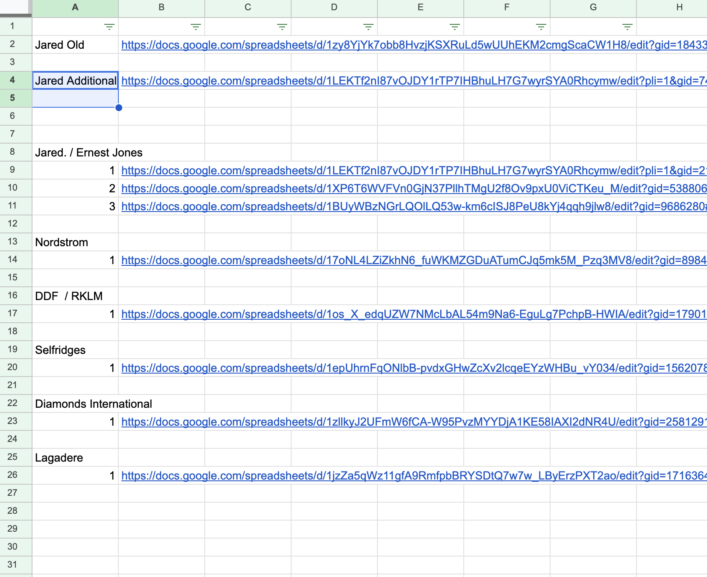
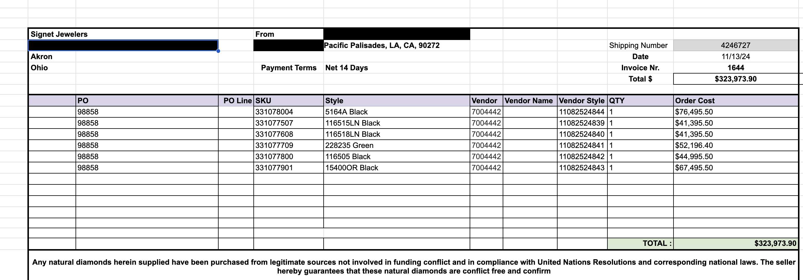

# invoice-data-automation
Google Apps Script project to automate invoice data extraction across multiple sheets. Maps SKUs and extracts PO, Shipping, Invoice Number, and Date.

## Overview
This project automates invoice data extraction across multiple Google Sheets using Google Apps Script.

## Problem
Manually searching SKUs and matching them to invoice sheets across multiple client files was time-consuming and inefficient.

## Solution
Developed a script that:
- Maps SKUs to invoice sheets
- Searches across multiple client files (such as Nordstrom and Jared)
- Extracts key data including:
  - PO Number
  - Shipping Number
  - Invoice Number
  - Date

## Features
- Supports multiple clients
- Searches across multiple files dynamically
- Handles inconsistent data formats
- Optimized to improve performance and reduce execution time

## Technologies Used
- Google Apps Script (JavaScript)
- Google Sheets

## Outcome
Reduced manual effort significantly and improved overall efficiency in processing invoice data.

## Future Improvements
- Integration with SQL databases
- Development of a reporting dashboard
## Screenshots

Here is a preview of my project:

## Screenshots of the Project

### Main Screens

### Links Feature

### Invoices

